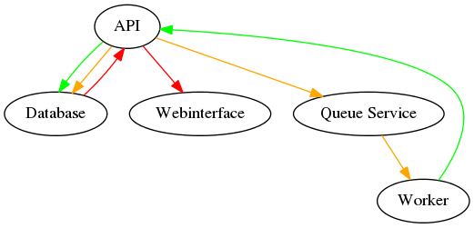

-- *Slide* --

# In the beginning

## The monolith

<a title="CATHERINE PRIOR [CC BY-SA 2.0 (http://creativecommons.org/licenses/by-sa/2.0)], via Wikimedia Commons" 
href="https://commons.wikimedia.org/wiki/File%3ASt_Breock_Down_Monolith_-_Standing_Stone_-_geograph.org.uk_-_109844.jpg">

</a>

-- *Slide* --

-- *Slide End* --

# Which decomposed

## Horizontally and vertically

<a title="By Bernard Gagnon (Own work) [GFDL (http://www.gnu.org/copyleft/fdl.html) or CC BY-SA 3.0 (http://creativecommons.org/licenses/by-sa/3.0)], via Wikimedia Commons" 
href="https://commons.wikimedia.org/wiki/File%3AStonehenge_02.jpg">
</a>

-- *Slide* --

-- *Slide End* --

# Then came the cloud

## Unconstrained supply

<a title="By Joydeep (Own work) [CC BY-SA 3.0 (http://creativecommons.org/licenses/by-sa/3.0)], via Wikimedia Commons" 
href="https://commons.wikimedia.org/wiki/File%3ACumulus_cloud_before_rain.jpg">
</a>

-- *Slide* --

-- *Slide End* --

# There was a period of Instability

## While we learned

<a title="By Nevit Dilmen (Own work) [GFDL (http://www.gnu.org/copyleft/fdl.html) or CC-BY-SA-3.0 (http://creativecommons.org/licenses/by-sa/3.0/)], via Wikimedia Commons" 
href="https://commons.wikimedia.org/wiki/File%3AUnstable_walk.jpg">
</a>

-- *Slide* --

-- *Slide End* --

# But convergence came

## With 'microservices'

<a href="https://commons.wikimedia.org/wiki/File:Cairn_at_Garvera,_Surselva,_Graubuenden,_Switzerland.jpg#/media/File:Cairn_at_Garvera,_Surselva,_Graubuenden,_Switzerland.jpg">
</a>

Licensed under <a title="Creative Commons Attribution-Share Alike 3.0
<p></p>" href="http://creativecommons.org/licenses/by-sa/3.0/">CC BY-SA 3.0</a> via <a href="//commons.wikimedia.org/wiki/">Wikimedia Commons</a>.</p>

-- *Slide* --

-- *Slide End* --

# A microservice

The entire team can be fed by two large Pizza's

-- *Slide* --

-- *Slide End* --

# Microservice goodness

* Scaling
* Modularity
* Change the parts independently
* Allow mix of technologies
* Ease development (can add developers!)
* Fault tolerant

-- *Slide* --

-- *Slide End* --

# Microservice badness

* Increased complexity
* More support
* Application speed
* Decentralized data
* Lock you into integration choices
* More points of failure

-- *Slide* --

-- *Slide End* --

# A sample application

## FAAFO

[First App Application For OpenStack](https://github.com/stackforge/faafo)

A handy dandy fractal generator

-- *Slide* --

-- *Slide End* --

# To explore it we need to run it...

So: 

[libcloud 0.15.1 or higher](https://libcloud.apache.org/getting-started.html)

-- *Slide* --

-- *Slide End* --

# Step 1: establish a connection

```python
from libcloud.compute.types import Provider
from libcloud.compute.providers import get_driver

auth_username = 'your_auth_username'
auth_password = 'your_auth_password'
auth_url = 'https://keystone.rc.nectar.org.au:5000/v2.0/tokens/'
project_name = 'your_project_name_or_id'
region_name = 'your_region_name'

provider = get_driver(Provider.OPENSTACK)
conn = provider(auth_username,
                auth_password,
                ex_force_auth_url=auth_url,
                ex_force_auth_version='2.0_password',
                ex_tenant_name=project_name,
                ex_force_service_region=region_name)
```

-- *Slide* --

-- *Slide End* --

# Step 2: list the images

```python
images = conn.list_images()
for image in images:
    print(image)
```

-- *Slide* --

-- *Slide End* --

# Step 3: list the flavors

```python
flavors = conn.list_sizes()
for flavor in flavors:
    print(flavor)
```

-- *Slide* --

-- *Slide End* --

# Step 4: get an image

```python
image_id = config.get('Cloud', 'image_id')
image = conn.get_image(image_id)
print(image)
```

-- *Slide* --

-- *Slide End* --

# Step 5: get a flavor

```python
flavor_id = config.get('Cloud', 'flavor_id')
flavor = conn.ex_get_size(flavor_id)
print(flavor)
```

-- *Slide* --

-- *Slide End* --

# Step 6: create a test instance

```python
instance_name = 'faafo'
testing_instance = conn.create_node(name=instance_name, image=image, size=flavor)
print(testing_instance)
```

-- *Slide* --

-- *Slide End* --

# Step 7: confirm its running

```python
instances = conn.list_nodes()
for instance in instances:
    print(instance)
```

-- *Slide* --

-- *Slide End* --

# Step 8: destroy the test instance

```python
conn.destroy_node(testing_instance)
```

-- *Slide* --

-- *Slide End* --

# Step 9:

```python
print('Checking for existing SSH key pair...')
keypair_name = config.get('Credentials', 'keypair_name')
pub_key_file = config.get('Credentials', 'pub_key_file')
keypair_exists = False
for keypair in conn.list_key_pairs():
    if keypair.name == keypair_name:
        keypair_exists = True

if keypair_exists:
    print('Keypair {} already exists. Skipping import'.format(keypair_name))
else:
    print('adding keypair...')
    conn.import_key_pair_from_file(keypair_name, pub_key_file)

for keypair in conn.list_key_pairs():
    print(keypair)
```

-- *Slide* --

-- *Slide End* --

# Step 10:
 
```python
print('Checking for existing security group...')
security_group_name = 'all-in-one'
security_group_exists = False
for security_group in conn.ex_list_security_groups():
    if security_group.name == security_group_name:
        all_in_one_security_group = security_group
        security_group_exists = True

if security_group_exists:
    print('Security Group {} already exists. Skipping creation'.format(all_in_one_security_group.name))
else:
    all_in_one_security_group = conn.ex_create_security_group(security_group_name,
                                                              'network access for all-in-one application.')
    conn.ex_create_security_group_rule(all_in_one_security_group, 'TCP', 80, 80)
    conn.ex_create_security_group_rule(all_in_one_security_group, 'TCP', 22, 22)

for security_group in conn.ex_list_security_groups():
    print(security_group)
```

-- *Slide* --

-- *Slide End* --

# Step 11: 

```python
userdata = '''#!/usr/bin/env bash
curl -L -s https://git.openstack.org/cgit/stackforge/faafo/plain/contrib/install.sh | bash -s -- \
    -i faafo -i messaging -r api -r worker -r demo
'''
```

-- *Slide* --

-- *Slide End* --

# Step 12:

```python
print('Checking for existing instance...')
instance_name = 'all-in-one'
instance_exists = False
for instance in conn.list_nodes():
    if instance.name == instance_name:
        testing_instance = instance
        instance_exists = True

if instance_exists:
    print('Instance {} already exists. Skipping creation'.format(testing_instance.name))
else:
    print('Creating new instance')
    testing_instance = conn.create_node(name=instance_name,
                                        image=image,
                                        size=flavor,
                                        ex_keyname=keypair_name,
                                        ex_userdata=userdata,
                                        ex_security_groups=[all_in_one_security_group])
    conn.wait_until_running([testing_instance])
```

-- *Slide* --

-- *Slide End* --

# fix for bug 

Where the instance isn't immediately updated with the instance data

```python
for instance in conn.list_nodes():
    if instance.id == testing_instance.id:
        testing_instance = instance

print (testing_instance)
```

-- *Slide* --

-- *Slide End* --

# FAAFO architecture



-- *Slide* --

-- *Slide End* --

# The path to follow

* Build the simplest thing that can work (a monolith)
* Make sure it's got well defined internal boundaries
* When confident you are on the right path, turn it into a neomonolith...
* The start to split out the microservices as you grow
